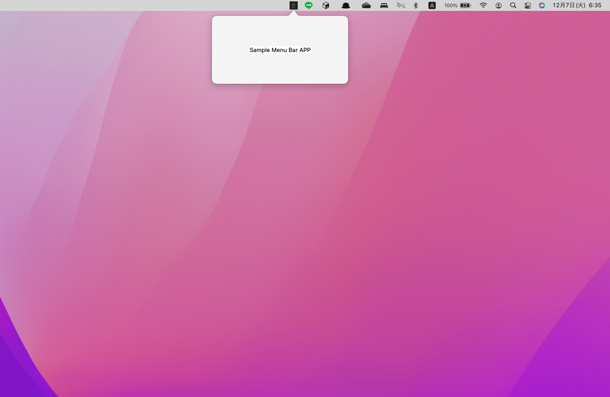

# MacOS-menu-bar-application-temp
MacOSを対象としたメニューバーアプリケーション作成用テンプレート

## リポジトリの説明  
MacOS PCのメニューバー上(その他の画面は持たない) で常駐して動作するアプリケーションを作成することが少し面倒そうだったので、テンプレートを作成しておきます。  

メニューバーアプリケーション：RunCatのようなメニューバー上でのみ動作するアプリケーションのこと  
注意：本リポジトリは、Swiftを触ったことがないものが作成しています。

## コメント  
どうやらメニューバーアプリケーションの作成方法がXcode Version 12(Swift Version5.3)から変わってしまった模様(ちょっとめんどくさそう)です。Swift完全初心者の自分からすると少し手こずったので、テンプレートを用意

## 対象Version
XCode：Version 13.1   
Swift：Version 5.5.1 (swiftlang-1300.0.31.4 clang-1300.0.29.6)  

## イメージ  

## 参考記事   
- https://dev.classmethod.jp/articles/xcode12_change_appdelegate/  
- https://qiita.com/6in/items/63b15ce02338783b4645